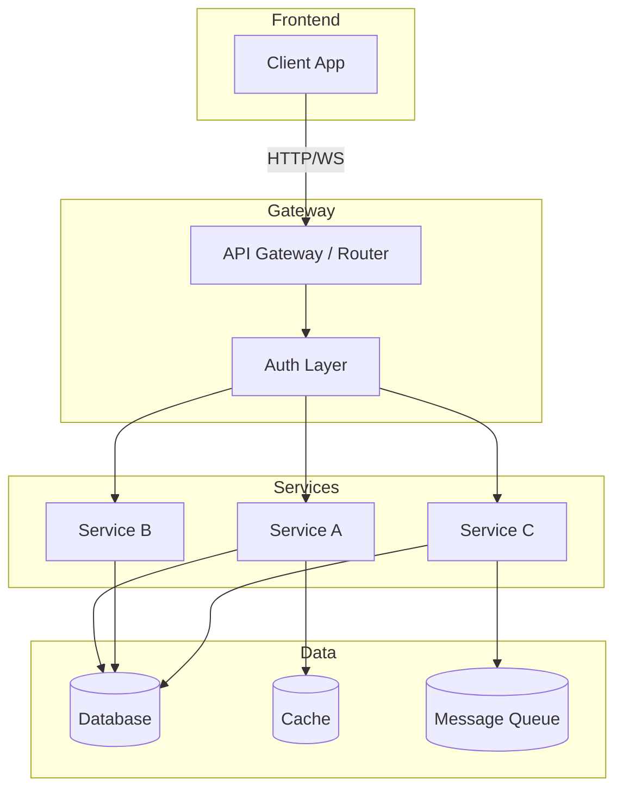

# Codebase Explorer

## Purpose

Produce a comprehensive, read-only map of any codebase. The output answers:
- How does this codebase work?
- How does everything link together?
- What are the important systems?
- What should a new developer learn first?
- Which is the most important part?
- How does a request flow through the system?
- What can you safely ignore?

## When to Use

Use this skill when:
- User asks to "explore", "understand", "map", or "review" a codebase
- User wants architecture docs, system diagrams, or onboarding guides
- User asks "how does this project work" or "trace the request flow"
- User needs to onboard onto an unfamiliar codebase
- User wants a knowledge graph, entity map, or dependency analysis
- User asks "what can I safely ignore" in a codebase

Do NOT use this skill when:
- User wants bugs fixed, code changed, or refactoring
- User wants a line-by-line code review for correctness
- User wants performance optimization or security auditing
- The codebase is a single-file script (too small to need mapping)

## Inputs

| Input | Required | Description |
|-------|----------|-------------|
| `TARGET_DIR` | Yes | Absolute path to the codebase root |
| `OUTPUT_DIR` | No | Where to write outputs (defaults to `TARGET_DIR/docs/exploration/`) |
| `DEPTH` | No | Directory tree depth limit (default: 5) |
| `SKIP_DIRS` | No | Comma-separated dirs to skip (default: node_modules,.git,dist,build,.next) |

## Cross-Skill References

This skill loads and delegates to other skills during its workflow:

| Skill | Location | Used For |
|-------|----------|----------|
| `frontend-design` | `file:///Users/nr/.agents/skills/frontend-design/SKILL.md` | HTML report styling, interaction states, responsive layout, dark/light mode |
| `preflight` agent personas | `file:///Users/nr/.agents/skills/preflight/agents/` | Review quality of exploration outputs using eng-reviewer, design-reviewer, security-reviewer personas |

Load these skills when entering their respective phases.

## Prerequisites

Before starting, verify a directory tree command is available:

```bash
# Step 1: try `tree` directly
if command -v tree >/dev/null 2>&1; then
  echo "tree found"
  exit 0
fi

# Step 2: not found — detect OS
OS=$(uname -s)
case "$OS" in
  Darwin)
    # macOS — install eza, alias as tree
    if ! command -v eza >/dev/null 2>&1; then
      brew install eza
    fi
    # Create persistent alias in shell config
    SHELL_CONFIG="$HOME/.zshrc"
    if ! grep -q "alias tree=" "$SHELL_CONFIG" 2>/dev/null; then
      echo "alias tree='eza --tree --icons'" >> "$SHELL_CONFIG"
    fi
    # For current session: define a shell function to emulate tree
    tree() { eza --tree --icons "$@"; }
    echo "tree alias set via eza"
    ;;
  Linux)
    # Linux — install tree via apt/yum, or use find fallback
    if command -v apt-get >/dev/null 2>&1; then
      sudo apt-get install -y tree
    elif command -v yum >/dev/null 2>&1; then
      sudo yum install -y tree
    else
      echo "tree not available — using fallback"
      tree() { find "$@" -print | sed -e 's;[^/]*/;|____;g;s;____|; |;g'; }
    fi
    ;;
  *)
    # Fallback: basic directory printer
    tree() { find "$@" -print | sed -e 's;[^/]*/;|____;g;s;____|; |;g'; }
    ;;
esac
```

After setup, `tree <dir>` produces the directory tree. In agent sessions where aliases may not load, use `eza --tree --icons <dir>` directly instead of the `tree` command.

## Workflow

### Phase 1: Discover

Run the directory tree to establish the physical layout:

```bash
TARGET_DIR=<path>
OUTPUT_DIR=<path>/docs/exploration
mkdir -p "$OUTPUT_DIR"/diagrams

# Generate directory tree (try eza first, fall back to tree)
if command -v eza >/dev/null 2>&1; then
  eza --tree --level=5 --ignore-glob='node_modules|.git|dist|build|.next' "$TARGET_DIR" > "$OUTPUT_DIR"/discover.md
else
  tree -L 5 -I 'node_modules|.git|dist|build|.next' "$TARGET_DIR" > "$OUTPUT_DIR"/discover.md
fi
```

Append to `discover.md`:
- Entry point files found (e.g., `main.go`, `index.tsx`, `app.py`, `server.js`)
- Configuration files (e.g., `package.json`, `Cargo.toml`, `go.mod`, `Dockerfile`)
- Top-level README or docs
- Test directories and their naming conventions

### Phase 2: Parallel Agents (Run Concurrently)

Launch 5 agents in parallel. Each produces a markdown section for the final report.

#### Agent A — Repository Explorer
- Maps: directory structure, file naming patterns, language distribution
- Identifies: monorepo vs polyrepo, microservices vs monolith, frontend/backend split
- Detects: build systems, package managers, CI/CD configs
- Output: `discover.md` (augmented)

#### Agent B — Architecture Generator
- Reads: entry points, routers, middleware, controllers, services, data layers
- Creates: request flow trace (frontend → API gateway → auth → service → DB)
- Identifies: layers, boundaries, dependency direction
- Output: `architecture.md`

#### Agent C — Graph / Diagram Generator
- Generates Mermaid.js diagrams for:
  - System context (C4 Level 1)
  - Container diagram (C4 Level 2)
  - Request flow sequence diagram
  - Entity-relationship diagram
  - Component dependency graph
- Output: `diagrams/` folder (`.md` files with embedded Mermaid)

#### Agent D — Knowledge Graph Generator
- Identifies: business domains, entities, bounded contexts
- Maps: which service owns which data, which store each entity touches
- Lists: critical paths through the system
- Output: `glossary.md` + `architecture.md` (knowledge map section)

#### Agent E — Onboarding Guide Generator
- Synthesizes all other outputs into a learning path
- Answers: "what to learn first", "what can you safely ignore"
- Ranks: areas by importance (P0, P1, P2)
- Provides: recommended reading order with file links
- Output: `onboarding.md`

### Phase 3: Synthesis

Merge all parallel outputs into a unified knowledge map.

**Knowledge Map** (placed at the top of every document):



Replace generic service names with actual names from the codebase.

### Phase 4: Generate Outputs

Generate two parallel output formats:

#### Markdown files (always written to `$OUTPUT_DIR/`):

| File | Contents |
|------|----------|
| `discover.md` | Directory tree, entry points, configs, language breakdown |
| `architecture.md` | Request flow, layer diagram, component interactions, mechanisms |
| `glossary.md` | Domain entities, data ownership, service responsibilities |
| `onboarding.md` | Learning path, importance ranking, safe-to-ignore areas |
| `diagrams/flow.mmd` | Mermaid sequence diagram |
| `diagrams/system.mmd` | C4 system context diagram |
| `diagrams/components.mmd` | Component dependency graph |
| `diagrams/entities.mmd` | Entity-relationship diagram |

#### HTML report (generated via `frontend-design` skill + merge script)

Load the `frontend-design` skill (`file:///Users/nr/.agents/skills/frontend-design/SKILL.md`) to design and build the HTML report. Delegate the following to it:

- **Layout**: sticky sidebar nav, scroll-spy highlighting, responsive breakpoints
- **States**: loading skeleton while Mermaid renders, empty state when sections are missing, error state for broken diagrams
- **Interactions**: smooth scroll, active nav tracking, back-to-top, keyboard nav (arrow keys between sections)
- **Visual design**: typography scale, color system (dark/light), spacing, hover/focus states on nav links
- **Mermaid integration**: live CDN render, dark/light theme sync, zoom/pan on large diagrams

After the frontend-design skill produces the HTML template at `assets/report-template.html`, run the merge script to inject content:

```bash
node scripts/generate-outputs.js "$OUTPUT_DIR"
```

| File | Contents |
|------|----------|
| `exploration-report.html` | Polished single-page HTML combining all outputs with interactive diagrams |

## Output Format

### `discover.md`

```markdown
# Repository Discovery

## Directory Tree
\`\`\`
<eza --tree output>
\`\`\`

## Entry Points
- `src/main.ts` — Application bootstrap
- `src/router/index.ts` — Route registration
...

## Configuration
- `package.json` — Dependencies & scripts
- `tsconfig.json` — TypeScript config
...

## Language Breakdown
| Language | Files | % of Codebase |
|----------|-------|---------------|
| TypeScript | 142 | 62% |
| Rust | 48 | 21% |
...
```

### `architecture.md`

```markdown
# Architecture

## System Context (C4 Level 1)
<mermaid diagram>

## Request Flow
1. Client sends HTTP request → API Gateway
2. Gateway authenticates → Auth Service
3. Auth validates JWT → passes claims
4. Route dispatched → Controller
5. Controller validates → calls Service
6. Service orchestrates → Data Layer
7. Response bubbles back up

## Component Interactions
| Component | Protocol | Depends On | Enables |
|-----------|----------|------------|---------|
| API Gateway | HTTP/gRPC | — | Rate limiting, auth |
| Auth Service | HTTP | User DB | JWT, RBAC |
| ... | ... | ... | ... |
```

### `glossary.md`

```markdown
# Glossary & Domain Map

## Entities
| Entity | Owned By | Stored In | Touched By |
|--------|----------|-----------|------------|
| User | Auth Service | `users` table | Auth, Profile, Billing |
| Order | Order Service | `orders` table | Cart, Payment, Shipping |
| ...

## Critical Paths
- User Registration → Auth → Profile → Welcome Email
- Purchase Flow → Cart → Order → Payment → Shipping
```

### `onboarding.md`

```markdown
# Onboarding Guide

## Priority Order
### P0 (Learn First)
- `src/core/` — The kernel of the system
- `src/router/` — All entry points

### P1 (Important)
- `src/services/` — Business logic

### P2 (Safe to Ignore Initially)
- `scripts/` — Build tooling
- `legacy/` — Deprecated modules
```

### `exploration-report.html`

A standalone HTML document containing:
- Interactive Mermaid diagrams rendered via live CDN
- Navigation sidebar with sections: Overview, Discover, Architecture, Glossary, Onboarding, Diagrams
- Knowledge map as the hero section
- Searchable table of contents
- Dark/light mode toggle
- Responsive layout

### Phase 5: Review (Optional)

If quality is critical, run outputs through `preflight` agent personas for review:

Load each reviewer persona from `file:///Users/nr/.agents/skills/preflight/agents/` and feed them the generated docs:

1. **`eng-reviewer.md`** — Reviews architecture.md for correctness, identifies missed dependencies, checks if request flow matches actual code paths
2. **`design-reviewer.md`** — Reviews exploration-report.html for interaction states (loading, empty, error), responsive behavior, information hierarchy
3. **`security-reviewer.md`** — Reviews glossary.md for data ownership/flows that could expose sensitive paths

Each reviewer produces a structured JSON finding. Fix high-risk or confidence<5 findings before delivery.

## Quality Bar

The result is good only if:
- A newcomer can understand the system from the outputs
- Every output answers a specific question from the Purpose section
- Architecture diagrams reflect actual code (not generic shapes)
- Glossary entries link to real code locations
- Onboarding guide contains specific file paths
- HTML report is self-contained (no broken links)
- Knowledge map is the most prominent visual element

## Failure Modes

Avoid:
- Generating generic architecture that could describe any system
- Making statements about data flow without tracing the actual code
- Skipping the directory tree exploration
- Producing diagrams disconnected from the codebase reality
- Overwhelming the user with every detail — prioritize P0/P1
- Generating HTML with broken diagrams or missing sections

## Improvement Loop

If output is weak:
1. Run the exploration at a deeper depth (`DEPTH=8`)
2. Expand the skip list if too many irrelevant dirs are included
3. Re-run agents with explicit file path hints from Phase 1 output
4. Manually inspect key files if auto-analysis misses critical paths
5. Regenerate HTML if diagrams fail to render
