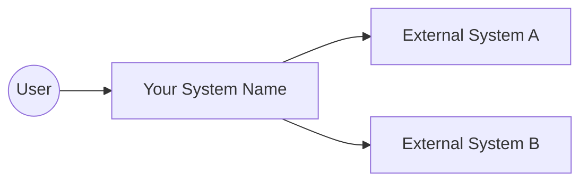
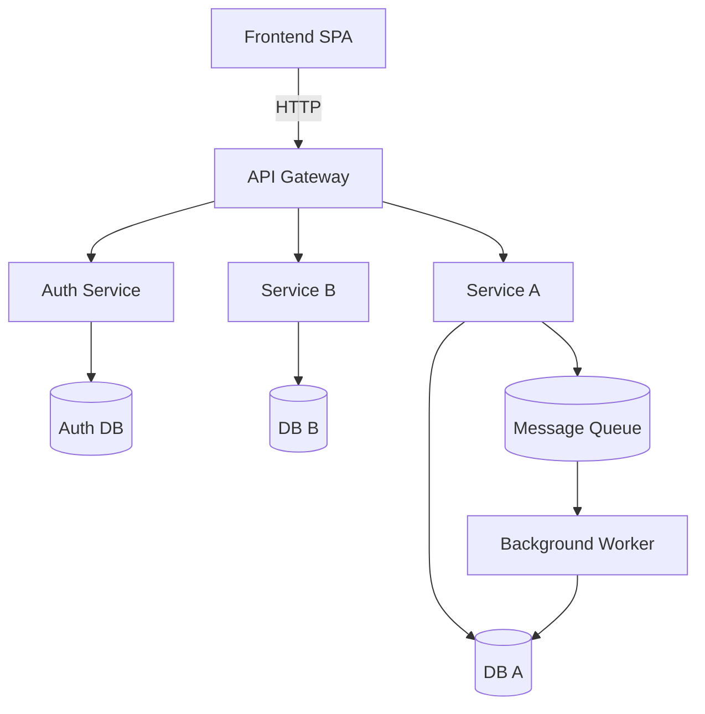

# Architecture Template

Use this template when writing `architecture.md` for a target codebase.

## Sections

### 1. System Context Diagram (C4 Level 1)



Replace with actual external actors and systems.

### 2. Container Diagram (C4 Level 2)



### 3. Request Flow Trace

```
Client Browser
    │ GET /api/orders
    ▼
API Gateway (nginx / envoy / custom)
    │ authenticate JWT
    ▼
Auth Middleware
    │ validate → attach user claims
    ▼
Router → OrderController.index()
    │ authorize (role: user)
    ▼
OrderService.listOrders(userId)
    │ build query
    ▼
OrderRepository.findAll({ userId })
    │ SQL SELECT
    ▼
PostgreSQL (orders table)
    │ return rows
    ▼
... bubble back up through each layer with transformation
```

### 4. Layer Map

| Layer | Directory | Responsibility | Guards |
|-------|-----------|----------------|--------|
| Presentation/UI | `src/pages/`, `src/components/` | Render UI, capture input | — |
| API/Router | `src/router/`, `src/controllers/` | Route matching, request parsing | Rate limiter |
| Auth | `src/middleware/auth.ts` | JWT validation, RBAC | Token expiry, role check |
| Business Logic | `src/services/` | Domain logic, orchestration | Input validation |
| Data Access | `src/repositories/` | Queries, ORM | Connection pool, timeout |
| Storage | `src/db/` | Schema, migrations | Migrations, constraints |

### 5. Mechanisms

| Mechanism | What It Does | Prevents | Enables |
|-----------|-------------|----------|---------|
| Rate Limiter | Throttle requests per IP/user | Abuse, DoS | Fair usage |
| Auth Middleware | Validate JWT per request | Unauthorized access | RBAC |
| Idempotency Key | Deduplicate writes | Duplicate orders | Retry safety |
| Circuit Breaker | Fail fast when downstream is down | Cascading failures | Graceful degradation |
| Validation Layer | Schema check on input | Invalid data | Type safety |

### 6. Service Deep Dive (per service)

For each service/component, document:

```markdown
### Service: Orders Service
**Location**: `src/services/orders/`
**Purpose**: Manage order lifecycle (create, update, cancel)
**Depends On**: Auth Service, Payment Service, Inventory Service
**Dependents**: Notification Service, Analytics Service
**Data Owned**: `orders`, `order_items` tables
**Entry Points**: `POST /api/orders`, `GET /api/orders/:id`, `PATCH /api/orders/:id`
**Key Files**:
- `OrdersController.ts` — HTTP handlers
- `OrdersService.ts` — Business logic
- `OrdersRepository.ts` — Data access
- `validators.ts` — Input validation schemas
```
